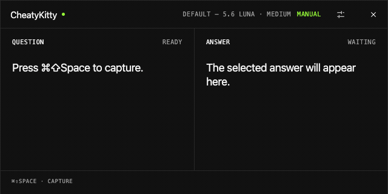
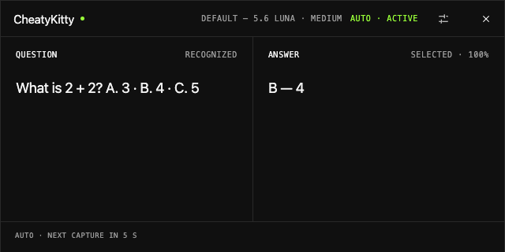
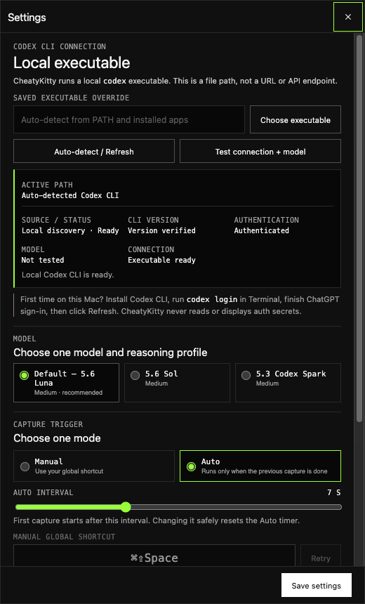

<p align="center">
  
</p>

<h1 align="center">CheatyKitty</h1>

<p align="center">
  <strong>A lightweight, unobtrusive on-screen bridge to Codex CLI.</strong>
  <br />
  Read visible test questions, ask your selected model, and see a concise suggested answer without switching apps.
</p>

<p align="center">
  
  
  
  <a href="LICENSE"></a>
</p>

<p align="center">
  <a href="#quick-start">Quick start</a> ·
  <a href="#what-it-does">What it does</a> ·
  <a href="#modes-and-models">Modes & models</a> ·
  <a href="#configuration">Configuration</a>
</p>

<p align="center">
  
</p>

> [!NOTE]
> CheatyKitty is a discreet overlay, not a guarantee of invisibility. Use it only where assistance is permitted; it does not evade third-party capture or proctoring.

> [!IMPORTANT]
> Version 1.0.0 is the first source release. It ships source code only; application builds are unsigned and not notarized. No official binary installer is included.

## What it does

CheatyKitty helps find answers to test questions already visible on your screen:

1. **Trigger** — Start a run with a global shortcut, or let Auto mode run every 3–15 seconds.
2. **Capture** — Capture the visible test question from the screen.
3. **Recognize** — Read the question and visible choices with image understanding and local Apple Vision OCR where needed.
4. **Select** — Ask the exact chosen Codex model, at `medium` reasoning, for the best visible answer.
5. **Present** — Show the recognized question and concise selection, such as `B — 4`, without switching apps.

Auto mode can repeat this answer flow hands-free after the previous run finishes. CheatyKitty suggests an answer; it **does not click, fill, or submit controls in other apps**.

## Product tour

### The answer stays in view

<p align="center">
  
</p>

The compact overlay supports a two-column **Question + Answer** view and a full-width **Answer only** view. It can stay above normal windows and across Spaces while remaining click-through outside the brand drag area and the Settings/Quit controls.

### Configuration without credential handling

#### Everything important is explicit

- Codex discovery, version, authentication, and exact-model diagnostics
- Luna, Sol, and Spark model selection with no silent fallback
- Manual shortcut or non-overlapping Auto capture
- 3–15 second Auto interval
- Question + Answer or Answer-only layout
- 25–100% main-overlay opacity

CheatyKitty has no API-key field and never copies ChatGPT or Codex credentials into its settings.

<p align="center">
  
</p>

## Modes and models

### Manual and Auto

- **Manual** — Press the configured global shortcut for an on-demand question or to cancel an active run.
- **Auto** — Repeat the answer flow every 3–15 seconds. Runs stay single-flight, skip busy ticks, and pause safely on error.

Manual and Auto are mutually exclusive.

### Supported Codex profiles

| Profile | Input path | Notes |
| --- | --- | --- |
| **Default — `gpt-5.6-luna` · medium** | Screenshot + optional local OCR context | Default visual route. |
| **`gpt-5.6-sol` · medium** | Screenshot + optional local OCR context | Alternative visual route. |
| **`gpt-5.3-codex-spark` · medium** | Local Vision OCR text only | Fails clearly if the capture cannot be read locally. |

CheatyKitty uses the chosen profile exactly and reports an error instead of silently switching models.

## Quick start

### Requirements

- Apple Silicon (`arm64`) Mac
- macOS 14 Sonoma or newer
- Node.js 22.12 or newer and npm
- Xcode Command Line Tools for the native macOS helpers
- Codex CLI authenticated through ChatGPT
- Screen Recording permission for CheatyKitty

Intel Macs and Windows/Linux are not supported.

### Run from source

```bash
npm ci
npm start
```

### Verify a change

```bash
npm run check
```

The check runs TypeScript validation (including unused code checks), automated tests, repository hygiene, a clean application build, icon fidelity checks, and a source smoke test. Authenticated model calls, Screen Recording permission, global shortcuts, multi-display behavior, VoiceOver, Gatekeeper, and packaged-app behavior remain manual release gates.

Run application checks locally on a supported Mac. Hosted CI runs TypeScript and repository hygiene checks only; it does not launch or test the application.

`npm run clean` removes generated build, coverage, visual-check, and release output. Dependencies remain available for development. Keep agent scratch files in the ignored `.agent-work/` directory; do not make application code or build tools depend on them. Repository hygiene supports both a normal checkout and a Git worktree.

During source development, macOS grants Screen Recording permission to Electron rather than to the packaged CheatyKitty bundle.

### Build an unsigned installer

The source release includes no prebuilt DMG. To create an unsigned Apple Silicon installer locally:

```bash
npm run dist:mac
```

The installer is written to `release/CheatyKitty-1.0.0-arm64.dmg`. Generated installers belong outside source history.

### Install an internal unsigned build

If you receive an independently reviewed internal DMG through an authorized channel:

1. Verify its separately supplied SHA-256 checksum.
2. Open the DMG and drag `CheatyKitty.app` to Applications.
3. In Finder, Control-click CheatyKitty and choose **Open**. If needed, use **System Settings → Privacy & Security → Open Anyway** only after verifying the source and checksum.
4. Allow CheatyKitty in **System Settings → Privacy & Security → Screen & System Audio Recording**, then quit and reopen it.

The current build is unsigned and not notarized. Do not treat it as publisher-verified.

## Configuration

### Connect Codex

1. Install Codex CLI, or an application bundle that includes it.
2. Run `codex login` in Terminal and finish ChatGPT sign-in.
3. Open CheatyKitty Settings and choose **Auto-detect / Refresh**.
4. If discovery cannot find Codex, choose the executable explicitly or configure `CODEX_PATH`.
5. Select a model and run **Test connection + model**.

Discovery checks a saved executable override, `CODEX_PATH`, `PATH`, common package-manager locations, and bundled Codex locations in installed Codex/ChatGPT apps. A wrong or missing saved override fails clearly.

Authentication remains owned by Codex CLI/ChatGPT; CheatyKitty does not ask for an API key.

## Project structure

- `src/` — Electron main process, preload bridge, renderer, settings, parser, and scheduling logic.
- `native/` — minimal ScreenCaptureKit and Vision OCR helpers for arm64 macOS.
- `tests/` — deterministic unit and contract tests with synthetic data.
- `scripts/` — build, visual, packaging, privacy, parity, and release verification tools.
- `assets/` — the canonical CheatyKitty icon source.
- `docs/media/` — reviewed synthetic screenshots used by this README.

## Contributing, security, and license

See [CONTRIBUTING.md](CONTRIBUTING.md), [SECURITY.md](SECURITY.md), and [CODE_OF_CONDUCT.md](CODE_OF_CONDUCT.md). CheatyKitty is licensed under the [MIT License](LICENSE). Electron/Chromium and development-tool notices are listed in [THIRD_PARTY_NOTICES.md](THIRD_PARTY_NOTICES.md).
